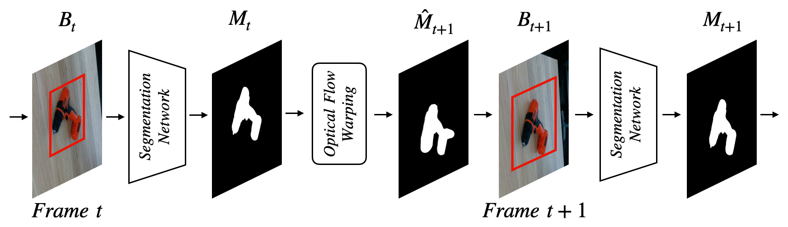
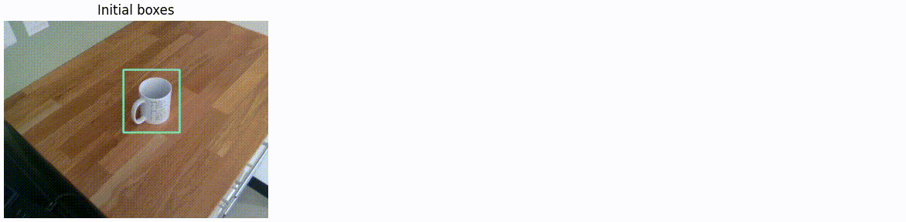

# PIZZA
Pytorch implementation of "PIZZA: A Powerful Image-only Zero-Shot Zero-CAD Approach to 6 DoF Tracking" paper

**[Van Nguyen Nguyen*](https://nv-nguyen.github.io/), 
[Yuming Du*](https://dulucas.github.io/), 
[Yang Xiao](https://youngxiao13.github.io/), 
[Michaël Ramamonjisoa](https://michaelramamonjisoa.github.io/) and 
[Vincent Lepetit](https://vincentlepetit.github.io/)**

Check out our [**paper**](https://arxiv.org/abs/2209.07589) for more details!

If our project is helpful for your research, please consider citing : 
``` Bash
@inproceedings{nguyen2022pizza,
  title={PIZZA: A Powerful Image-only Zero-Shot Zero-CAD Approach to 6 DoF Tracking},
  author={Nguyen, Van Nguyen and Du, Yuming and Xiao, Yang and Ramamonjisoa, Michael and Lepetit, Vincent},
  journal={{International Conference on 3D Vision (3DV)}},
  year={2022}
}
```

## Installation :man_mechanic:

We recommend creating a new Anaconda environment to use *pizza*. Use the following commands to setup a new environment:
```
conda env create -f environment.yml
conda activate pizza

# Assuming that you are in the root folder of "pizza"
pip install mmcv-full==1.3.8 -f https://download.openmmlab.com/mmcv/dist/cu102/1.7.0/index.html
cd mmdetection
pip install -r requirements/build.txt
pip install -v -e .

# Assuming that you are in the root folder of "pizza"
cd mmsegmentation
pip install -e .  # or "python setup.py develop"
```
## 2D object tracking in the wild with [1st Place Solution for the UVO Challenge](https://arxiv.org/abs/2110.11661)
Note: We track objects not seen during the training with [1st Place Solution for the UVO Challenge](https://arxiv.org/abs/2110.11661). This implementation is slightly modified comparing to [the original repo](https://github.com/dulucas/UVO_Challenge) to make it easy to run on different dataset of [BOP challenge](https://bop.felk.cvut.cz/challenges/): 



1. Download pretrained-weights:
- [Pretrained weight of segmentation model (2.81GB)](https://drive.google.com/file/d/1rwV_TkBLYTl6hj5tOyP68QR6g-sILE1a/view?usp=sharing)
- [Pretrained weight of RAFT things (21MB)](https://drive.google.com/file/d/1v6Jf5espR4LDpFCMnrJB9DhhlajHlGfh/view?usp=sharing)
- [(Optinal) Pretrained weight of detection model (2.54GB)](https://drive.google.com/file/d/1iiZl8Ha_mYOqBNNjiehV0DBvBJgAGm6O/view?usp=sharing) (when initial boxes are not provided)
```bash
export WEIGHT_ROOT=$YOUR_WEIGHT_ROOT
# for example export WEIGHT_ROOT=/home/nguyen/Documents/results/UVO
bash ./scripts/download_uvo_weights.sh
```
**Optional:** You can download with attached gdrive links above manually.

2. Organize the dataset as in [BOP challenge](https://bop.felk.cvut.cz/challenges/), for example with [YCB-V dataset](https://bop.felk.cvut.cz/media/data/bop_datasets/ycbv_test_all.zip):
```bash
$INPUT_DATA (ycb-v folder)
    ├── video1 
        ├── rgb
        ├── ...
    ├── video2 
        ├── rgb
        ├── ...
    ├── ...
```
3. Run detection and segmentation

Update file "input_dir", "output_dir" and "weight_dir" in configs/config_path.json
```bash
python -m lib.track.demo
```



## 3D pose regression
1. Download testing datasets. 
We provide here the pre-generated synthetic images for ModelNet's experiments (checkout [DeepIM paper](https://arxiv.org/pdf/1804.00175.pdf) for more details):
- [Synthetic images from ModelNet's CAD models (2.38 GB)](https://drive.google.com/file/d/1v6Jf5espR4LDpFCMnrJB9DhhlajHlGfh/view?usp=sharing)
```bash
bash ./scripts/download_modelNet.sh
```
2. To launch a training:
```bash
python -m train --exp_name modelNet
```

3. To reproduce the quantitative results:
- Download [checkpoint](https://drive.google.com/file/d/16O0yWc3PPrlsHxACvf8ZFaMK3Eaoc_Xa/view?usp=sharing)
```bash
bash ./scripts/download_modelNet_checkpoint.sh

python -m test --exp_name modelNet --checkpoint $CHECKPOINT_PATH
```
## Acknowledgement

The code is based on [mmdetection](https://github.com/open-mmlab/mmdetection), [mmsegmentation](https://github.com/open-mmlab/mmsegmentation), [videowalk](https://github.com/ajabri/videowalk), [RAFT](https://github.com/princeton-vl/RAFT) and [template-pose](https://github.com/nv-nguyen/template-pose). Many thanks to them!